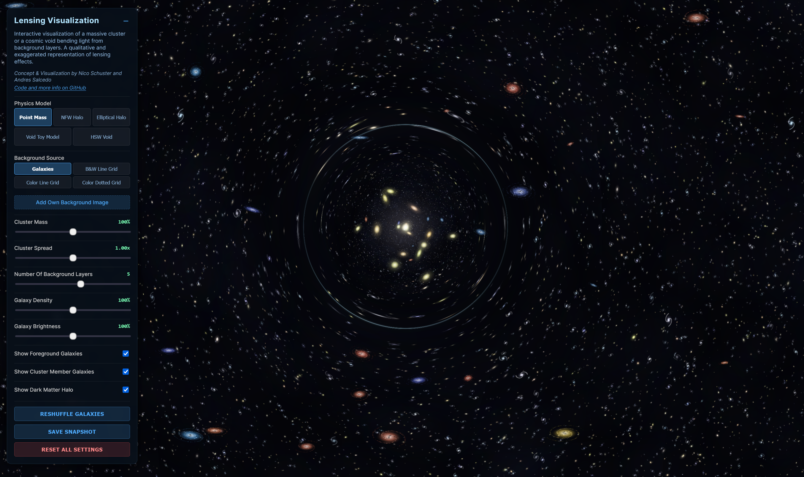

# Visualizing Gravitational Lensing


[**🔴 Live Demo**](https://nicosmo.github.io/lensing_visualization/)

**Concept & Visualization by [Nico Schuster](https://orcid.org/0000-0001-5620-8554) and [Andres Salcedo](https://orcid.org/0000-0003-1420-527X)**

An interactive browser-based WebGL visualization that renders real-time gravitational lensing effects. It visualizes how light from background galaxies is distorted by a massive foreground cluster or void (the "lens"), allowing users to toggle between different physics models and background sources.

**Note:** This tool is a qualitative visualization designed for educational illustration. While it utilizes real physical density profiles (NFW, Voids), it employs thin-lens approximations and simplified rendering to achieve real-time browser performance.



## Features

### Physics & Visualization
* **Real-time Ray Shooting:** Uses custom GLSL fragment shaders to calculate light deflection pixel-by-pixel using **Inverse Ray Tracing** (Thin Lens Approximation).
* **Physics Models:**
    * **Point Mass:** Simulates a simple, singular dense mass (potential $\propto 1/r$).
    * **NFW Halo:** Simulates a **Navarro-Frenk-White** dark matter profile, representing the realistic mass distribution of galaxy clusters.
    * **Voids:** Simulates a cosmic void with an approximated matter profile, representing a simplified HSW profile.
* **Multi-Plane Lensing:** Simulates depth by treating the background as multiple distinct layers, creating parallax effects and varying distortion based on distance.

### Rendering & Procedural Generation
* **Procedural Universe:** Background galaxies and the foreground cluster/void are generated procedurally using seeded random numbers. Every "Reshuffle" creates a unique, consistent star field.
* **Parallax Depth:** Foreground stars, the cluster/void lens, and background layers move at different rates to simulate 3D space.
* **Custom Sprites:** Uses HTML5 Canvas to pre-render galaxy sprites (spirals and ellipticals) for high-performance rendering.

### Interactivity
* **Dynamic Controls:** Adjust Cluster Mass, Spread (Einstein Radius), Galaxy Density, and Brightness in real-time, as well as Void Inner Density and Void Size
* **Custom Backgrounds:** Upload your own images to see how they are distorted by the lens. The repository contains an example image of the Hubble Ultra Deep Field for the background.
* **Interactive Lens:** Drag the mouse to move the lens; click to lock it in place for inspection.
* **Snapshot Export:** Save high-resolution PNG snapshots of the current lensing state for presentations or wallpapers.
* **Reshuffling:** Instantly generate a new random seed to create a completely unique background galaxy field.

---

## Getting Started

Since this project relies on native browser technologies (HTML5, Three.js via CDN), there is no build process required.

### Prerequisites
* A modern web browser (Chrome, Firefox, Safari, Edge) with WebGL enabled.
* An internet connection (to load the Three.js library from cdnjs).

### Running Locally
For the best experience (and to avoid browser security restrictions with local textures), it is recommended to use a local server rather than double-clicking the HTML file:

1. Open your terminal in the project folder.
2. Run `python3 -m http.server 8080`
3. Open `http://localhost:8080` in your browser.

---

## Project Structure

```
lensing_visualization/
├── index.html              # Main HTML file with UI structure
├── css/
│   └── styles.css          # All CSS styles
├── js/
│   ├── utils.js            # Seeded RNG & helper functions
│   ├── galaxy-factory.js   # Galaxy sprite generation
│   ├── textures.js         # Texture creation functions
│   ├── shaders.js          # WebGL vertex & fragment shaders
│   ├── ui.js               # UI controls & event handlers
│   └── app.js              # Main application initialization
├── examples/
│   ├── lensing_example.png # Screenshot used in README
│   └── Hubble_ultra_deep_field_high_rez.jpg # Sample background image
├── package.json            # NPM dependencies & scripts
├── .eslintrc.json          # ESLint configuration
├── .prettierrc             # Prettier configuration
└── .gitignore              # Git ignore rules
```

---

## Development

### Dependencies

Development dependencies (linting & formatting):
* [ESLint](https://eslint.org/) - JavaScript linting (Airbnb style guide)
* [Prettier](https://prettier.io/) - Code formatting
* Python 3 - Local development server (built-in `http.server`)
* [Node.js + npm](https://nodejs.org/) - Required only for the linting/formatting toolchain

Install (optional) dev tooling dependencies:
```bash
npm install
```

### NPM Scripts (Dev Tooling)

Use npm for linting and formatting tasks:
```bash
npm run lint        # Check for linting errors
npm run lint:fix    # Auto-fix linting errors
npm run format      # Format all files
npm run format:check # Check formatting
```

---


## Usage

### Controls
* **Move Lens:** Move your mouse (or drag on touch devices) to position the galaxy cluster / cosmic void.
* **Lock Position:** Click anywhere on the canvas to **LOCK** the lens position. Click again to unlock.
* **UI Panel:** Use the top-left panel to toggle settings. (Click `-` to minimize).
* **Save Snapshot:** Downloads the current view as a .png with a timestamp and attribution

## Visual Modes
The tool offers different background modes to help visualize the distortion field:
* **Galaxies:** A procedurally generated deep field for realistic visualization.
* **Grids (B&W / Color):** High-contrast grid lines that make the specific warping geometry (shear and convergence) immediately visible.
* **Dotted Grid:** Useful for seeing density changes and magnification effects clearly.

### Using Custom Images
You can upload your own images to test the lensing effect:
1.  Open the UI Panel.
2.  Click **"Add Own Background Image"**.
3.  Select an image from your computer.
    * *Tip: You can upload multiple images to create multi-layer depth effects.*

### Included Test Data
This repository includes a high-resolution astronomical image for testing:
* **File:** `examples/Hubble_ultra_deep_field_high_rez.jpg`
* **Description:** A section of the Hubble Ultra-Deep Field, ideal for visualizing how a cluster/void distorts a realistic background field.
* **Source:** Wikipedia (Accessed Dec 17, 2025).

---

## The Science

The simulation calculates the deflection angle $\vec{\alpha}$ of light rays as they pass near the lens.


### Point Mass Model
Assumes all mass is concentrated at a single point. Deflection decreases linearly with distance ($1/r$). This creates a sharp "Einstein Ring" but theoretically infinite deflection at the center.

### NFW (Navarro-Frenk-White) Profile
Modeled on the density distribution of dark matter halos as described in [Navarro, Frenk & White (1997)](https://ui.adsabs.harvard.edu/abs/1997ApJ...490..493N/abstract). It provides a "softer" core than a point mass, meaning the lensing effect does not approach infinity at the center. This creates the more complex, realistic distortions typical of massive galaxy clusters.

### Void Model
Simulates a cosmic void—a large under-dense region of space—bounded by a dense "wall" or ridge. Unlike the Point Mass or NFW profiles, which act purely as converging lenses, this model can simulate under-dense regions (negative convergence/repulsive lensing).

The density profile $\delta(x) = \rho(x) / \bar{\rho} - 1$ (density contrast) is defined piecewise based on the normalized radius $x = r / r_v$ (where $r_v$ is the void radius and controlled by a slider). The profile features a smooth "bucket" shape with a flat inner core and a thin outer ridge:

Void Core ($x < 0.1$):
A central region of constant under-density: $\delta(x) = \delta_{min}$ (adjustable by slider with values in % of mean density)

Void Interior ($0.1 \le x < 1.0$):
A smooth quadratic transition that rises from the core density to the wall density.
$\delta(x) = \delta_{min} + (\delta_{wall} - \delta_{min}) \left( \frac{x - 0.1}{0.9} \right)^2$ ; 
$\delta_{wall}$ is fixed to 0.05

Void Wall ($1.0 \le x < 1.05$):
A thin, dense shell where the density peaks at $\delta_{wall} = 0.05$ and drops linearly to zero.
$$\delta(x) = 1.05 - x$$
(Matches $\delta=0.05$ at $x=1$ and $\delta=0$ at $x=1.05$)

Exterior ($x \ge 1.05$):
Zero density contrast (mean cosmological density).


---

## Credits
* **Concept & Visualization:** Nico Schuster and Andres Salcedo
* **Code Generation:** Google Gemini 3 Pro
* **Library:** Built with [Three.js](https://threejs.org/)
* **Test Image:** NASA/ESA (Hubble Ultra-Deep Field)

The authors of this code thank Simon Bouchard, Wei Liu, Alice Pisani, Lucas Sauniere, and Georgios Valogiannis for useful discussions. Nico Schuster would like to thank Tim Eifler, Elisabeth Krause, and Enrique Paillas for their hospitality at the CosmoLab of the University of Arizona, which facilitated the discussions that led to this project.

## License

This project is licensed under the **Creative Commons Zero v1.0 Universal (CC0)**.
You can copy, modify, distribute and perform the work, even for commercial purposes, all without asking permission. See the [LICENSE](LICENSE) file for details.
