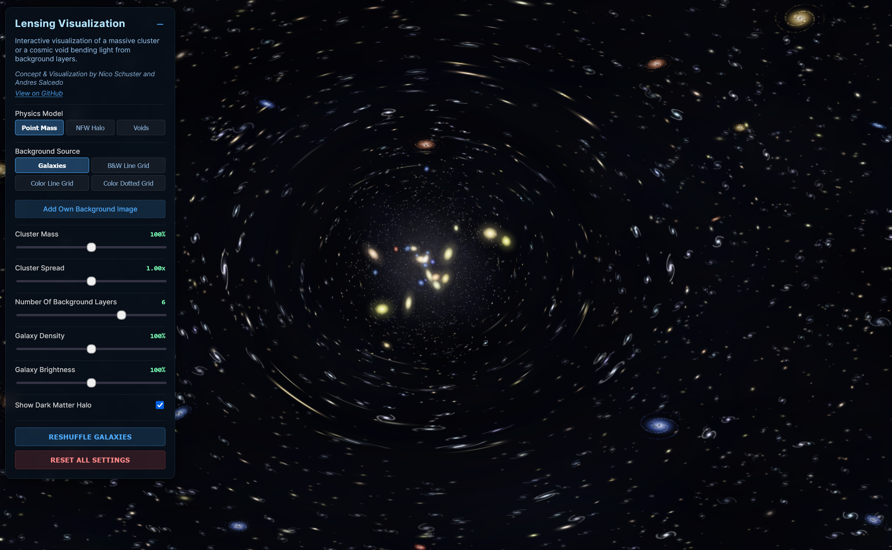

# Visualizing Gravitational Lensing


[**🔴 Live Demo**](https://nicosmo.github.io/lensing_visualization/)

**Concept & Visualization by [Nico Schuster](https://orcid.org/0000-0001-5620-8554) and [Andres Salcedo](https://orcid.org/0000-0003-1420-527X)**

An interactive browser-based WebGL visualization that renders real-time gravitational lensing effects. It visualizes how light from background galaxies is distorted by a massive foreground cluster (the "lens"), allowing users to toggle between different physics models and background sources.



## Features

### Physics & Visualization
* **Real-time Ray Shooting:** Uses custom GLSL fragment shaders to calculate light deflection pixel-by-pixel using **Inverse Ray Tracing** (Thin Lens Approximation).
* **Physics Models:**
    * **Point Mass:** Simulates a simple, singular dense mass (potential $\propto 1/r$).
    * **NFW Halo:** Simulates a **Navarro-Frenk-White** dark matter profile, representing the realistic mass distribution of galaxy clusters.
* **Multi-Plane Lensing:** Simulates depth by treating the background as multiple distinct layers, creating parallax effects and varying distortion based on distance.

### Rendering & Procedural Generation
* **Procedural Universe:** Background galaxies and the foreground cluster are generated procedurally using seeded random numbers. Every "Reshuffle" creates a unique, consistent star field.
* **Parallax Depth:** Foreground stars, the cluster lens, and background layers move at different rates to simulate 3D space.
* **Custom Sprites:** Uses HTML5 Canvas to pre-render galaxy sprites (spirals and ellipticals) for high-performance rendering.

### Interactivity
* **Dynamic Controls:** Adjust Cluster Mass, Spread (Einstein Radius), Galaxy Density, and Brightness in real-time.
* **Custom Backgrounds:** Upload your own images to see how they are distorted by the lens.
* **Interactive Lens:** Drag the mouse to move the lens; click to lock it in place for inspection.

---

## Getting Started

Since this project relies on native browser technologies (HTML5, Three.js via CDN), there is no build process required.

### Prerequisites
* A modern web browser (Chrome, Firefox, Safari, Edge) with WebGL enabled.
* An internet connection (to load the Three.js library from cdnjs).

### Installation

1.  Clone the repository:
    ```bash
    git clone [https://github.com/yourusername/lensing_visualization.git](https://github.com/yourusername/lensing_visualization.git)
    cd lensing_visualization
    ```

2.  **Run the simulation:**
    Simply open `index.html` in your web browser.

---

## Usage

### Controls
* **Move Lens:** Move your mouse (or drag on touch devices) to position the galaxy cluster.
* **Lock Position:** Click anywhere on the canvas to **LOCK** the lens position. Click again to unlock.
* **UI Panel:** Use the top-left panel to toggle settings. (Click `-` to minimize).

### Using Custom Images
You can upload your own images to test the lensing effect:
1.  Open the UI Panel.
2.  Click **"Add Own Background Image"**.
3.  Select an image from your computer.
    * *Tip: You can upload multiple images to create multi-layer depth effects.*

### Included Test Data
This repository includes a high-resolution astronomical image for testing:
* **File:** `Hubble_ultra_deep_field_high_rez.jpg`
* **Description:** A section of the Hubble Ultra-Deep Field, ideal for visualizing how a cluster distorts a realistic background field.
* **Source:** Wikipedia (Accessed Dec 17, 2025).

---

## The Science

The simulation calculates the deflection angle $\vec{\alpha}$ of light rays as they pass near the lens using the **Lens Equation** ($\vec{\beta} = \vec{\theta} - \vec{\alpha}(\vec{\theta})$).

### Point Mass Model
Assumes all mass is concentrated at a single point. Deflection decreases linearly with distance ($1/r$). This creates a sharp "Einstein Ring" but theoretically infinite deflection at the center.

### NFW (Navarro-Frenk-White) Profile
Modeled on the density distribution of dark matter halos as described in [Navarro, Frenk & White (1997)](https://ui.adsabs.harvard.edu/abs/1997ApJ...490..493N/abstract). It provides a "softer" core than a point mass, meaning the lensing effect does not approach infinity at the center. This creates the more complex, realistic distortions typical of massive galaxy clusters.

---

## Credits
* **Concept & Visualization:** Nico Schuster and Andres Salcedo
* **Code Generation:** Google Gemini 3 Pro
* **Library:** Built with [Three.js](https://threejs.org/)
* **Test Image:** NASA/ESA (Hubble Ultra-Deep Field)

## License

This project is licensed under the **Creative Commons Zero v1.0 Universal (CC0)**.
You can copy, modify, distribute and perform the work, even for commercial purposes, all without asking permission. See the [LICENSE](LICENSE) file for details.
