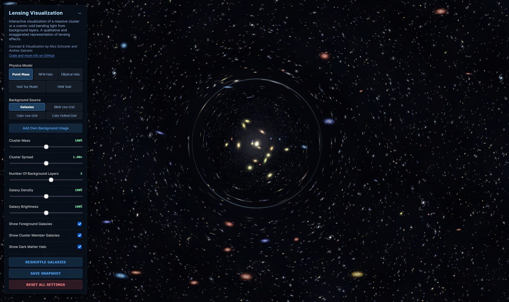

# Visualisierung von Gravitationslinsen


[](https://doi.org/10.5281/zenodo.18914869) und [](https://arxiv.org/abs/2603.18145)


[** Live Demo**](https://nicosmo.github.io/lensing_visualization/)

**Konzept & Visualierung von [Nico Schuster](https://orcid.org/0000-0001-5620-8554) und [Andres Salcedo](https://orcid.org/0000-0003-1420-527X). Deutsche Übersetzung von Nico Schuster.**


Eine interactive und Webbrowser basierte WebGL-Visualisierung, die Gravitationslinseneffekte in Echtzeit rendert. Es wird dargestellt, wie Licht von Hintergrundgalaxien durch massive Cluster oder Voids (die "Linsen") verzerrt wird. Es wird Nutzern außerdem ermöglicht, zwischen verschiedenen Physik Modellen und Hintergrundquellen zu wechseln.


**Anmerkung:** Diese Anwendung ist eine qualitative Visualisierung, für didaktische Illustrationen konzipiert. Obwohl das Modell reale physikalische Dichteprofile (NFW-Halos, HSW-Voids sowie vereinfachte Modelle) verwendet, greift es auf die Näherung einer dünnen Linse und vereinfachte Darstellungen zurück, um eine Echtzeit-Leistung im Browser zu erzielen. Die Gravitationslinseneffekte werden verstärkt und übertrieben dargestellt, um die visuelle Klarheit zu verbessern. Tatsächlich liegen die Verzerrungen durch schwache Gravitationslinsen bei einzelnen Galaxien in der Regel in der Größenordnung von $1$% (z.B., [Weinberg et al.,2013](https://ui.adsabs.harvard.edu/abs/2013PhR...530...87W/abstract)).





## Mitwirken & Feedback
Beiträge, Vorschläge für neue Funktionen und Fehlermeldungen sind herzlich willkommen!
* Wenn du eine Idee hast oder einen Fehler gefunden hast, erstelle bitte ein Issue auf GitHub.
* Wenn du Code beisteuern möchtest, kannst du das Repository gerne forken und einen Pull Request einreichen.


## Funktionen

### Physik & Visualisierung
* **Echtzeit-Ray-Shooting:** Verwendet benutzerdefinierte GLSL-Fragment-Shader, um die Lichtbeugung Pixel für Pixel mithilfe von **Inverse Ray Tracing** (Dünne Linse Näherung) zu berechnen.
* **Physikmodelle:**
    * **Punktmasse:** Simuliert eine einfache, singuläre  Masse (Potential $\propto 1/r$).
    * **NFW Halo:** Simuliert ein **Navarro-Frenk-White**-Profil für Dunkle Materie, das die realistische Massenverteilung von Galaxienhaufen abbildet.
    * **Elliptisches Halo:** Simuliert ein isothermes Ellipsoid-Materieprofil, einschließlich Kaustiken.
    * **Vereinfachtes Void Modell:** Simuliert einen vereinfachten Void (Unterdichte Region im Universum) unter Verwendung eines stückweise quadratischen Dichteprofils mit einer überdichten Region außerhalb.
    * **HSW Void:** Simuliert ein realistisches, universelles Voidprofil basierend auf **[Hamaus, Sutter & Wandelt (2014)](https://arxiv.org/abs/1403.5499)**, mit einstellbaren inneren/äußeren Gefällen und Skalenradius.
* **Mehrere Ebenen:** Simuliert Tiefe, indem der Hintergrund als mehrere separate Ebenen behandelt wird, wodurch Parallaxeneffekte und entfernungsabhängige Verzerrungen erzeugt werden.
* **Massendichte-Diagramm:** Ein Echtzeit-1D-Diagramm des Dichteprofils $\delta(r)$ ermöglicht es dem Benutzer, die genaue Struktur der simulierten Linse zu visualisieren.

### Darstellung & prozedurale Generierung
* **Prozedurales Universum:** Die Galaxien im Hintergrund sowie der Sternhaufen/Void im Vordergrund werden prozedural unter Verwendung von zufälligen Startwerten generiert. Bei jedem "Neu Anordnen" entsteht ein einzigartiges, konsistentes Galaxienfeld.
* **Parallax-Tiefe:** Galaxien im Vordergrund, die Linsenwirkung durch Galaxienhaufen und Voidsn sowie die Hintergrundebenen werden unterschiedlich verzerrt, um einen dreidimensionalen Raum zu simulieren.
* **Benutzerdefinierte Sprites:** Nutzt HTML5 Canvas, um Galaxien-Sprites (Spiral- und Elliptische Galaxien) vorab zu rendern und so eine hohe Darstellungsleistung zu erzielen.

### Interaktivität
* **Dynamische Steuerelemente:** Passe die Clustermasse, die Ausdehnung, die Galaxiendichte und die Helligkeit in Echtzeit an.
* **Erweiterte Steuerelemente für Voids:** Passe die Eigenschaften der Voids fein an, darunter Wanddichte, Wandbreite, Skalenradius ($r_s$), inneres Gefälle ($\alpha$) und äußeres Gefälle ($\beta$).
* **Benutzerdefinierte Hintergründe:** Lade deine eigenen Bilder hoch, um zu sehen, wie sie durch die Linse verzerrt werden. Das Repository enthält ein Beispielbild des Hubble Ultra Deep Field als Hintergrund.
* **Interaktives Linsenobjekt:** Bewege die Maus, um das Linsenobjekt zu verschieben. Klicken Sie, um es zur Begutachtung an Ort und Stelle zu fixieren.
* **Export von Momentaufnahmen:** Speicher hochauflösende PNG-Momentaufnahmen des aktuellen Linseneffekts für Präsentationen oder als Hintergrundbilder.
* **Neu mischen:** Generiere sofort einen neuen Zufallswert, um ein völlig einzigartiges Galaxienfeld zu erstellen.

### Plattformübergreifend & mobil
* **Unterstützung für Mobilgeräte und Touchscreens:** Vollständige Unterstützung für Browser auf Mobilgeräten und Tablets. Verschiebe die Linse durch Ziehen mit dem Finger und tippe darauf, um die Koordinaten zu sperren oder zu entsperren.
* **Offline-Zugriff (PWA):** Als Progressive Web App entwickelt. Du kannst die Visualisierung direkt auf deinem Desktop oder dem Startbildschirm deines Mobilgeräts installieren, um sie ohne Internetverbindung nativ auszuführen.


---
## Erste Schritte

Da dieses Projekt auf nativen Browsertechnologien (HTML5, Three.js über CDN) basiert, ist kein Build-Prozess erforderlich.

### Voraussetzungen
* Ein moderner Webbrowser (Chrome, Firefox, Safari, Edge) mit aktiviertem WebGL.
* Eine Internetverbindung (zum Laden der Three.js-Bibliothek von cdnjs).


### Lokale Ausführung
Für ein optimales Erlebnis (und um Sicherheitsbeschränkungen des Browsers bei lokalen Texturen zu vermeiden) wird empfohlen, einen lokalen Server zu verwenden, anstatt auf die HTML-Datei zu doppelklicken:
1. Öffnen dein Terminal im Projektordner.
2. Führe `python3 -m http.server 8080` aus.
3. Öffne `http://localhost:8080` in deinem Browser.

---

## Projektstruktur

```
lensing_visualization/
├── index.html              # Haupt-HTML-Datei mit UI-Struktur
├── css/
│   └── styles.css          # Alle CSS styles
├── js/
│   ├── utils.js            # RNG mit Startwert und Hilfsfunktionen
│   ├── galaxy-factory.js   # Erstellung von Galaxie-Sprites
│   ├── textures.js         # Funktionen zur Texturerzeugung
│   ├── shaders.js          # WebGL-Vertex- und Fragment-Shader
│   ├── ui.js               # UI-Steuerelemente und Ereignisbehandler
│   └── app.js              # Initialisierung der Hauptanwendung
├── examples/
│   ├── lensing_example.png # In der README-Datei verwendeter Screenshot
│   └── Hubble_ultra_deep_field_high_rez.jpg # Beispiel für ein Hintergrundbild
├── package.json            # NPM-Abhängigkeiten und Skripte
├── .eslintrc.json          # ESLint-Konfiguration
├── .prettierrc             # Prettier Konfiguration
└── .gitignore              # Git-Ignore-Regeln
```

---

## Entwicklung

### Abhängigkeiten

Entwicklungsabhängigkeiten (Linting & Formatierung):
* [Node.js + npm](https://nodejs.org/) – Nur für die Linting-/Formatierungs-Toolchain erforderlich

Installiere (optionale) Abhängigkeiten für Entwicklungswerkzeuge:
```bash
npm install
```

### NPM-Skripte (Entwickler-Tools)

Verwende npm für Linting- und Formatierungsaufgaben:
```bash
npm run lint        # Auf Linting-Fehler prüfen
npm run lint:fix    # Linting-Fehler automatisch beheben
npm run format      # Alle Dateien formatieren
npm run format:check # Formatierung prüfen
```
---

## Verwendung

### Steuerung
* **Linse verschieben:** Bewege die Maus (oder ziehen auf Touch-Geräten), um den Galaxienhaufen bzw. den Void zu positionieren.
* **Position fixieren:** Klicke an eine beliebige Stelle auf der Leinwand, um die Objektivposition zu **FIXIEREN**. Klicke erneut, um die Fixierung aufzuheben.
* **UI-Panel:** Verwende das Panel oben links, um Einstellungen zu ändern. (Klicke auf `-`, um es zu minimieren).
* **Snapshot speichern:** Lädt die aktuelle Ansicht als .png-Datei mit Zeitstempel und Quellenangabe herunter

## Darstellungsmodi
Das Tool bietet verschiedene Hintergrundmodi zur Visualisierung des Gravitationslinseneffekte:
* **Galaxien:** Ein prozedural generiertes Deep-Field für eine realistische Darstellung.
* **Gitter (Schwarz-Weiß / Farbe):** Kontrastreiche Gitterlinien, die die spezifische Verformungsgeometrie (Scherung und Konvergenz) sofort sichtbar machen.
* **Punktgitter:** Nützlich, um Dichteänderungen und Vergrößerungseffekte deutlich zu erkennen.

### Eigene Bilder verwenden
Du kannst eigene Bilder hochladen, um den Linseneffekt zu testen:
1.  Öffne das UI-Panel.
2.  Klicke auf **„Eigenes Hintergrundbild hinzufügen“**.
3.  Wähle ein Bild von deinem Computer aus.
    * *Tipp: Du kannst mehrere Bilder hochladen, um mehrschichtige Tiefeneffekte zu erzeugen.*

### Enthaltene Testdaten
Dieses Repository enthält ein hochauflösendes astronomisches Bild zu Testzwecken:
* **Datei:** `examples/Hubble_ultra_deep_field_high_rez.jpg`
* **Beschreibung:** Ein Ausschnitt aus dem Hubble Ultra-Deep Field, ideal zur Veranschaulichung, wie ein Cluster/Void realistisches Hintergrundfeld verzerrt.
* **Quelle:** Wikipedia (Zugriff am 17. Dezember 2025).

---

## Die Wissenschaft

Die Simulation berechnet den Ablenkungswinkel $\vec{\alpha}$ der Lichtstrahlen, wenn diese in der Nähe der Linse vorbeilaufen.

### Punktmassenmodell
Geht davon aus, dass die gesamte Masse an einem einzigen Punkt konzentriert ist. Die Lichtablenkung nimmt linear mit der Entfernung ab ($1/r$). Dies erzeugt einen scharfen "Einstein-Ring", jedoch eine theoretisch unendliche Lichtablenkung im Zentrum.

### NFW-Profil (Navarro-Frenk-White)
Basiert auf der Dichteverteilung von Halos aus dunkler Materie, wie in [Navarro, Frenk & White (1997)](https://ui.adsabs.harvard.edu/abs/1997ApJ...490..493N/abstract) beschrieben. Es liefert einen "weicheren" Kern als eine Punktmasse, was bedeutet, dass der Linseneffekt im Zentrum nicht gegen unendlich geht. Dies erzeugt die komplexeren, realistischeren Verzerrungen, die für massive Galaxienhaufen typisch sind.

### Elliptischer Halo (NIE)
Simuliert ein nicht-singuläres isothermes Ellipsoid (NIE) auf der Grundlage von [Kormann et al. (1994)](https://ui.adsabs.harvard.edu/abs/1994A%26A...284..285K/abstract). Im Gegensatz zu den anderen symmetrischen Modellen führt dieses Modell Elliptizität und Orientierung ein und ermöglicht so die Visualisierung komplexer tangentialer und radialer Kaustikkurven mithilfe eines Echtzeit-Marching-Squares-Algorithmus. Bei diesem Modell können kritische Kurven (auf der Linsenebene) und Kaustiken (auf der Quellenebene) dynamisch überlagert werden. Lichtquellen, die eine Kaustik kreuzen, werden extrem vergrößert und in mehrere Bilder aufgespalten. Die Kaustiknetzwerke werden in Echtzeit mithilfe eines 2D-Marching-Squares-Algorithmus gerendert, um die Nullkonturen der inversen Vergrößerungs-Jacobimatrix nachzuzeichnen.

### Void-Spielzeugmodell
Simuliert einen Void, einen großen Bereich des Weltraums mit geringer Dichte, der von einer überdichten „Wand“ begrenzt wird. Im Gegensatz zu den Punktmassen- oder NFW-Profilen, die rein als konvergierende Linsen wirken, kann dieses Modell Bereiche mit geringer Dichte simulieren (negative Konvergenz/abstoßende Linseneffekte).

Das Dichteprofil $\delta(x) = \rho(x) / \bar{\rho} - 1$ (Dichtekontrast) wird stückweise auf der Grundlage des normierten Radius $x = r / r_v$ definiert (wobei $r_v$ der Voidradius ist). Das Profil weist eine glatte "Eimer"-Form mit einem flachen inneren Kern und einer einstellbaren äußeren Wand auf:

**Void-Zentrum ($x < 0,05$):**
Ein zentraler Bereich konstanter Unterdichte: $\delta(x) = \delta_{min}$ (einstellbar über den Schieberegler "Innere Dichte").

**Void-Inneres ($0,05 \le x < 1,0$):**
Ein glatter polynomischer Übergang, der von der Dichte im Zentrum $\delta_{min}$ zur maximalen Wanddichte $\delta_{wall}$ ansteigt.

**Void-Wand ($1,0 \le x < 1,0 + w$):**
Eine dichte Wand, in der die Dichte bei $\delta_{wall}$ ihren Höchstwert erreicht (einstellbar über "Höchste Wand-Dichte") und über eine Breite $w$ (einstellbar über "Äußeres Ende der Wand") quadratisch auf Null abfällt:
$$\delta(x) = \delta_{wall} \left( 1 - \frac{x - 1.0}{w} \right)^2$$

**Außenbereich ($x \ge 1,0 + w$):**
Dichtekontrast gleich Null (mittlere kosmologische Dichte).


### HSW-Profil (Hamaus-Sutter-Wandelt)
Simuliert ein realistisches "universelles" Void-Dichteprofil, wie in [Hamaus, Sutter & Wandelt (2014)](https://arxiv.org/abs/1403.5499) beschrieben. Dieses empirische 4-Parameter-Modell liefert eine genauere Darstellung von Voids, die in N-Körper-Simulationen und Galaxienvermessungen gefunden werden.

Der Dichtekontrast ist gegeben durch:
$$\delta(r) = \delta_c \frac{1 - (r/r_s)^\alpha}{1 + (r/r_s)^\beta}$$

Dabei gilt:
* $\delta_c$: Zentraler Dichtekontrast (wird über den Schieberegler "Innere Dichte" gesteuert)
* $r_s$: Skalenradius (wird über den Schieberegler "Skalierungs-Radius" gesteuert)
* $\alpha$: Innere Steigung, die bestimmt, wie steil der Anstieg vom Zentrum ist
* $\beta$: Äußere Steigung, die bestimmt, wie schnell die Dichte zum kosmischen Mittelwert zurückkehrt

Die Visualisierung integriert dieses Dichteprofil numerisch, um die Linseneffekt-Ablenkungswinkel in Echtzeit zu berechnen.


### Geometrischer Linseneffizienz
Die Visualisierung verwendet einen vereinfachte geometrische Linseneffizienz unter der Annahme normalisierter euklidischer Abstände:

$$\text{Effizienz} = \frac{D_{LS}}{D_S} \approx \frac{d_{\text{Quelle}} - d_{\text{Linse}}}{d_{\text{Quelle}}} = 1 - \frac{d_{\text{Linse}}}{d_{\text{Quelle}}}$$

Diese Heuristik ahmt das qualitative Verhalten des physikalischen Linsendistanzverhältnisses $D_{LS}/D_S$ nach und erzeugt eine visuell plausible Zunahme der Verzerrungsstärke für Quellen, die weiter entfernt von der Linse sind. Sie ist eher für die tiefenskalierte Darstellung als für eine vollständige kosmologische Behandlung von Entfernungen gedacht.


---

## Impressum
* **Konzept & Visualisierung:** Nico Schuster und Andres Salcedo
* **Code-Generierung:** Google Gemini 3 Pro
* **Bibliothek:** Erstellt mit [Three.js](https://threejs.org/)
* **Testbild:** NASA/ESA (Hubble Ultra-Deep Field)

Die Autoren dieses Codes danken Dennis Frei für seine wertvollen Beiträge zur Entwicklung des Codes sowie Pierre Boccard, Simon Bouchard, Nico Hamaus, Mike Hudson, Wei Liu, Alice Pisani, Lucas Sauniere, Georgios Valogiannis und Julien Zoubian für die hilfreichen Diskussionen. Nico Schuster dankt Tim Eifler, Elisabeth Krause und Enrique Paillas für ihre Gastfreundschaft am CosmoLab der University of Arizona, die die Diskussionen ermöglichte, aus denen dieses Projekt hervorging. NS wird durch den Investitionsplan „France 2030“ der französischen Regierung (A*MIDEX AMX-22-CEI-03) unterstützt.

Der Algorithmus zur Berechnung und Darstellung der Kaustik- und kritischen Kurven basiert auf Formalismen aus dem Python-Paket [lenstronomy](https://github.com/lenstronomy/lenstronomy), das auf [Birrer et al. (2015)](https://ui.adsabs.harvard.edu/abs/2015ApJ...813..102B/abstract), [Birrer & Amara (2018)](https://ui.adsabs.harvard.edu/abs/2018PDU....22..189B/abstract) sowie [Birrer et al. (2021)](https://joss.theoj.org/papers/10.21105/joss.03283).


## Quellenangabe

Wenn Du dieses Tool für Forschungs- oder Bildungszwecke nutzt, gebe bitte folgende Quellenangabe an:


[](https://doi.org/10.5281/zenodo.18914869)

```bibtex
@software{schuster_lensing_2026,
  author       = {Schuster, Nico and Salcedo, Andr{\'e}s N. and Frei, Dennis},
  title        = {Visualizing Gravitational Lensing: v1.0.0},
  month        = mar,
  year         = 2026,
  publisher    = {Zenodo},
  version      = {v1.0.0},
  doi          = {10.5281/zenodo.18914869},
  url          = {[https://doi.org/10.5281/zenodo.18914869](https://doi.org/10.5281/zenodo.18914869)}
}
```

## Datenschutz und Webanalyse

Die GitHub-Pages-Website dieses Projekts nutzt [GoatCounter](https://www.goatcounter.com/), ein datenschutzfreundliches Open-Source-Tool zur Webanalyse. Es ermöglicht es, zu sehen, wie viele Besucher die Website hat, ohne dass personenbezogene Daten erfasst oder Cookies verwendet werden.

## Lizenz

Dieses Projekt unterliegt der **Creative Commons Zero v1.0 Universal (CC0)**.
DU darfst das Werk kopieren, verändern, verbreiten und aufführen, auch für kommerzielle Zwecke, ohne vorherige Genehmigung einholen zu müssen. Weitere Informationen sinde in der Datei [LICENSE](LICENSE).

